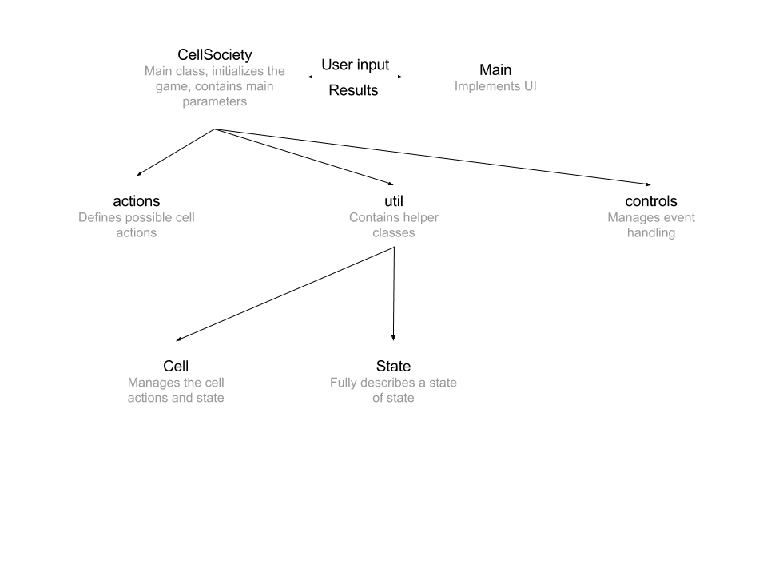

# Team 15

## Introduction
The goal of this project is to automate a CA (Cellular Automata) simulation of a group of cells that are modeled to interact in atleast a 2D grid space using 
JavaFX. The automation program will define, among other things, the degrees of freedom at which the different states or configurations of the cells can be simulated. 
For instance, our program will define the default starting configuration of the cells versus their eventual interactive behavior throughout the course of the simulation.
In order to facilitate a certain level of program-user interaction, the program will be designed in such a way that the user will be able to change the variables 
of the simulation depending on the degree of freedom assigned for them. In our program, we will define which variables will be changeable (i.e. the color of the cells, etc) 
as well as the pre-determined variables that the user won't have the option to change (i.e. the initial starting configuration of the cells). 

In the course of progamming the simulation of this cellular interraction, we hope to appreciate Stephen Walfram's conviction and belief in CA (Cellular Automata). The 
program will be powerful tool that will allow researchers an unlimited opportunity to study the behavioral interaction of the cells using this simulation. This is the 
power of CA (Cellular Automata), or any scientific simulation for that matter, that Walfram believed has the power to move scientific research and discovery forward.

## Overview
The CellSociety class manages all the interactions between all the components.
It performs computations, calculates grid's update and keeps history of all interactions

Main class is the visualizer, which displays states, calculated by CellSociety,
listens to all the inputs and allows user to interact with the simulation

Cell performs computations and updates it's own update

Actions define actions any type of cell takes

## User Interface
The game will start with a screen displaying a welcome message, and then four buttons where the user can choose which type of simulation they would like to run. This welcome text will have to be read from a resource file as it can't be hard-coded as stated in the specification. Once one of these buttons is clicked on the screen will change into one asking for user input first of how many rows and then how many columns the user would like for the simulation. We decided that we needed a lower bound for this program so that it could run effectively. Obviously negative numbers would be impossible for the number of rows and number of columns, but we also realized that one row/column wouldn't work as each cell needs to check neighboring cells (one above or one below them) and these wouldn't exist in smaller input values. Therefore, if the input value is 1 or lower, the program will ask the user to input again with a bigger number so that the visualization can show. 

Related to this, we are unsure whether to put an upper bound on the number of rows and columns. Although it should technically be possible to have an infinite number of cells under this model, when actually computing a simulation there will be input values for rows and columns that would simply be too big to implement effectively - the program would not be able to run quickly and it could possibly crash. Therefore, we thought it would be a good idea to cap the number of rows and columns that the user can input, possibly at 100. This will most likely change, however, as we start to code and test with different values. We would like to allow the user to choose as big a number as possible without causing it to affect the program negatively. 

After the user inputs the data, the grid will appear in its initialized update, which will be chosen randomly, with some factors chosen by user input (for example we may let the user decide the number of empty blocks, ratio of one block style to another etc.) The user will then be prompted to press ENTER to start the simulation, which will run automatically. There will be speed + and - buttons to increase and decrease the speed of simulation throughout.  There will also be an option available at all times to press ESC to return to the main menu. At any time during the automated simulation, the user can press P to pause the game (and ENTER to start it again). If the simulation is paused, the user will then be given the option to use the arrow keys to navigate forward and backwards through each update. 

We're unsure at the moment if it would be better to use arrow keys or a slider. We feel that a slider would be easier to move many steps at a time (for example if you want to move 200 steps then you just move the slider to near the end of the program, rather than having to press a key 200 times). However, we realized that the slider will need to know the finishing time of the program in order to have an end point, and this could prove impossible if the program has no end (For example in Segregation if the similarity percentage is too high and the program keeps running indefinitely). For this reason we decided to start with the arrow keys, as it would be something that definitely works, but if we feel that a slider is possible, we would try to implement it as best we could. 

Finally, we need to be sure that the cells will move simultaneously, as described in the prompt. Even though we will be iterating through each cell checking them one at a time, the program should update all the cells at (approximately) the same time after checking all available cells. 

## Design Details
The cell's actions are defined using IAction interface. In order to create an action
one has to create a class within actions package which implements IAction and 
specify it as an action associated with a specific cell type in the XML file.

XML parser parses and validates an xml to be a valid config file, by comparing
it against an XSD file, as well as performing additional CellSociety-specific
checks 

The UI will process user input and send commands to calculate grid for any
given generation and initial update. It stores all the previously calculated states,
as well as updates all cells.

In order to calculate new cell states, it uses Cell class and it's action.

This structure will allow us to create a flexible generalized platform to implement
various 2D CellSociety, by allowing custom actions for each cell type. Our goal is
to have as little hard-coded elements as possible
## Design Consideration

We first considered the degree of freedom that we want to give to users. More precisely, we were thinking about what aspects of the cell society game should be determined by user input. There were several aspects: grid dimension, number of cells, cell dimension, percentage of each initial update. We also thought about whether we should pre-determine the shape and size of the cells, can they be irregular in shape, of variant sizes? 

We also debated about whether it’s possible to have a playback, which let the game store it’s previous update so that user could get back at those later easily and quickly. One of us was concerned about whether it would take up much space.

In addition, we also discussed what kind of user input we would take after the whole process had started. We agreed that we could not let the users to change the dimension of the grid and cells. However, we were considering that we could let the user pause the process, change the speed of process taking place, and move back to any moment that’s passed by.

## Team Responsibilities
Peilin will learn how XML works and how we can use it for the game.

Matt will be the main person working on the user interface, including all buttons, keyboard input. 

We will work on the back-end coding part all together, in which Ramil will take the lead, and assign the other two team members tasks, potentially using “Issue” function on Gitlab.

At this point, we don’t want to assign very specific tasks for each person yet, because none of us is 100% sure what we are going to do, and many aspects of this game still need to be figured out together.